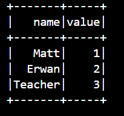
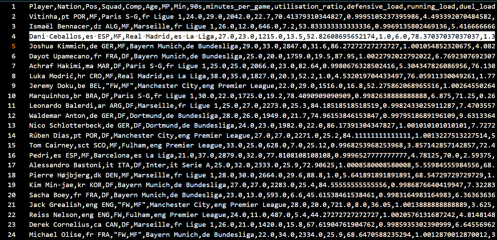
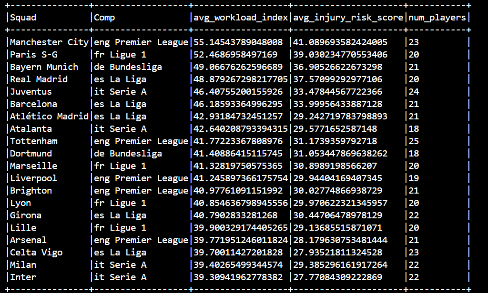

# Spark Player Workload Project
# Spark Player Workload Project

# Spark Player Workload Analysis  
Technical Big Data Project – Apache Spark + Docker

## 1. Introduction  

This project was developed as part of the *Big Data Introduction* final evaluation (Option A – Technical Project).  
As both team members are passionate about sports performance and athlete management, we decided to explore how Big Data processing can help quantify *physical workload, identify **overuse patterns, and estimate **injury-risk indicators* for professional football players.

Modern football produces a vast quantity of event-based and tracking data. Clubs increasingly rely on analytics to manage players’ intensity, avoid overload, and optimize training schedules.  
Our goal in this project is to build a simplified but realistic workload evaluation pipeline using *Apache Spark, running inside a fully containerized environment using **Docker*.

This project demonstrates our ability to:
- Install and configure a Big Data processing engine (Spark)
- Execute distributed computations on structured sports data
- Build custom metrics (defensive load, running effort, duel intensity)
- Rank players and teams based on workload and injury-risk factors
- Produce clean analytical outputs in distributed Spark format  
- Structure the work following professional engineering standards

This repository contains everything required to reproduce the analysis.

## 2. Dataset Origin  

The dataset used for this project is derived from publicly available football statistics inspired by *FBref* and *StatsBomb-style advanced metrics*.  
It includes detailed information for players across the 2024–2025 European season:
- Playing time and appearances during season
- Defensive actions (tackles, interceptions, blocks)  
- Ball progression metrics  
- Running volume / progression distance  
- Fouls, duels, recovery metrics  
- Club, league, nationality  
- Positional information  
Two dataset variants were created:
- *Full dataset (~250 columns)*  
- *Light dataset*, optimized for Spark and used in this project:
  players_data_light-2024_2025.csv

This lighter version ensures faster execution in a containerized Spark environment.


## 3. Repository Structure  

BigDataProject/
│
├── docker-compose.yml → Spark environment configuration
│
├── src/
│ ├── analysis.py → Full Spark workload analysis
│ ├── minimal_example.py → Minimal Spark test script
│
├── data/
│ └── players_data_light-2024_2025.csv → Dataset used in this project
│
├── output/
│ └── player_workload/
│ ├── overall_top20/ → Top 20 workload players
│ ├── top_by_position/ → Top 10 players by position
│ ├── team_summary/ → Team-level workload analysis
│ └── full_player_workload/ → Full enriched dataset
│
├── screenshots/
│ ├── minimal_example.png → Output of minimal Spark job
│ ├── workload_top20.png → Top 20 workload output
│ ├── workload_positions.png → Top players by position
│ ├── workload_teams.png → Team-level workload summary
│ └── output_structure.png → Proof of Spark output folders
│
└── README.md → This documentation

## 4. Correspondence With Required Deliverables  

| Requirement from professor                                             | Location in repo |
|-----------------------------------------------------------------------|------------------|
| Project title + short description                                     | Top of README |
| Chosen tool (Spark) + justification                                   | "Why Spark?" section |
| Installation steps                                                     | Section 5 |
| Minimal working example                                                | src/minimal_example.py + screenshot |
| Screenshots proving execution                                          | /screenshots/ folder |
| Explanation of how tool fits Big Data ecosystem                        | Section 6 |
| Challenges encountered                                                 | Section 8 |
| “My Setup Notes”                                                       | Section 9 |
| Configuration files                                                    | docker-compose.yml |
| Scripts / code                                                         | src/ |
| Sample data                                                            | /data/ |
| Output data                                                            | /output/player_workload/ |


## 5. Installation & Execution Steps

Below is the complete sequence of commands and actions required to install and execute the project.

```bash
# STEP 1 — Clone the repository
git clone https://github.com/<your_repo>/spark-player-workload.git
cd spark-player-workload


# STEP 2 — Ensure Docker Desktop is running
# (Spark cannot start unless Docker engine is active)


# STEP 3 — Start the Spark container
docker-compose up -d


# STEP 4 — Verify Spark is running
docker ps
# Expected: a container named "spark" should appear.


# STEP 5 — Run the minimal Spark job (environment validation)
docker exec -it spark /opt/spark/bin/spark-submit minimal_example.py
# Output: small test table printed in terminal.
# Screenshot example: screenshots/minimal_example.png


# STEP 6 — Run the full Spark workload analysis
docker exec -it spark /opt/spark/bin/spark-submit analysis.py
# Output: workload tables, rankings, injury-risk scores.


# STEP 7 — Inspect Spark-generated outputs
# All results will appear under:
#   output/player_workload/
#       ├── overall_top20/
#       ├── top_by_position/
#       ├── team_summary/
#       └── full_player_workload/

# Screenshot example: screenshots/output_structure.png


# STEP 8 — (Optional) Stop containers when finished
docker-compose down
```

## 7. Screenshots & Execution Proof

This section provides visual proof of the correct execution of all Spark processes, as required for the technical Big Data project.

### 7.1 Minimal Working Example (Spark Job)
This screenshot confirms that Spark was successfully initialized inside Docker and executed a simple transformation.


### 7.2 Top 20 Players by Workload Index
This output demonstrates the successful computation of custom workload metrics and ranking.


### 7.3 Workload Ranking by Position
Spark correctly classified players by primary position and produced the top 10 per role.


### 7.4 Team-Level Workload Summary
This screenshot confirms aggregation logic at team level (mean workload + injury risk).


### 7.5 Spark Output Folder Structure
Proof that Spark generated distributed output folders in CSV partition format.

