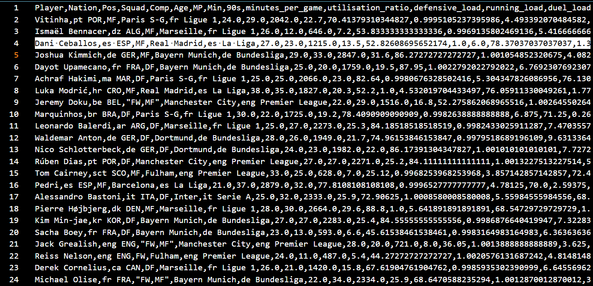
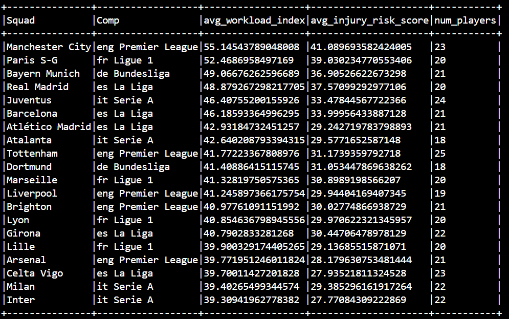
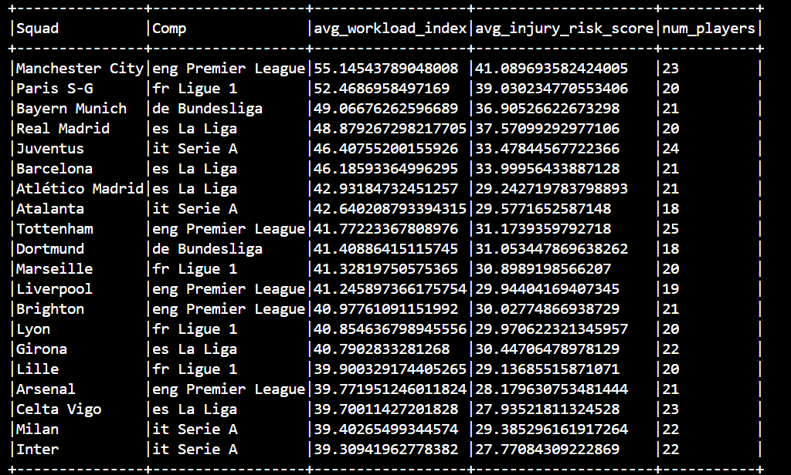

# Spark Player Workload

**Which professional footballers carried the heaviest physical load in 2024–25, and who is most exposed to overuse?**

A distributed data pipeline built with **Apache Spark** and **Docker** that turns raw season statistics for 2,854 players across Europe's big five leagues into workload metrics, an injury-risk proxy, and rankings by player, position and team.



> **Live dashboard:** [spark-player-workload.streamlit.app](https://spark-player-workload-ckgewcsgm8x2bkddlbt7cj.streamlit.app/) - risk map, rankings, filters by league / position / minutes.

## What it does

1. Loads a season dataset (FBref-style advanced stats, 2024–25) into Spark.
2. Keeps players with meaningful game time (≥ 5 full-match equivalents), 1,987 of them.
3. Derives per-90-minute load metrics from raw counts:
   - `running_load` — progressive carrying distance per 90
   - `defensive_load` — tackles + interceptions per 90
   - `duel_load` — fouls committed per 90 (a proxy for duel intensity)
4. Combines them into a **workload index** (40 % running, 40 % defensive, 20 % duels) and scales it by playing time to get an **injury-risk score**.
5. Writes four outputs as partitioned CSV: overall top 20, top 10 per position, team summary, and the full enriched table.

Everything runs inside a single Spark container, so the analysis is reproducible on any machine with Docker.

## Key findings

- **15 of the top 20 players by workload index are defenders**, the other 5 midfielders. Jérémy Doku (Manchester City) tops the ranking on running load alone, while Iñigo Martínez, Rúben Dias and Marquinhos combine high running and defensive load over 1,700 to 2,500 minutes.
- Once playing time is factored in, **defenders dominate the injury-risk score** too: they accumulate load *and* minutes, which is exactly the overuse pattern clubs monitor.
- At team level, average workload varies sharply between clubs, which points to differences in playing style (pressing, possession) rather than just fitness.

## Stack

| Layer | Tool |
|---|---|
| Processing | Apache Spark 3 (PySpark, DataFrame API, window functions) |
| Environment | Docker / docker-compose |
| Language | Python |
| Data | CSV, 2,854 rows × 165 columns (Premier League, La Liga, Serie A, Bundesliga, Ligue 1) |

## Run it

```bash
git clone https://github.com/Matt1333/spark-player-workload.git
cd spark-player-workload

docker-compose up -d                                             # start Spark
docker exec -it spark /opt/spark/bin/spark-submit minimal_example.py   # sanity check
docker exec -it spark /opt/spark/bin/spark-submit analysis.py          # full analysis
docker-compose down
```

Results land in `output/player_workload/`:

```
output/player_workload/
├── overall_top20/         top 20 players by workload index
├── top_by_position/       top 10 per position (GK / DF / MF / FW)
├── team_summary/          average workload and risk per club
└── full_player_workload/  every player with all derived metrics
```

## Explore the results

A Streamlit dashboard reads the Spark outputs and makes them interactive (**[open the live app](https://spark-player-workload-ckgewcsgm8x2bkddlbt7cj.streamlit.app/)**): a load-vs-minutes risk map, rankings, per-position and per-club views, with filters by league, position and minutes played. No Spark needed at runtime.

```bash
pip install -r requirements.txt
streamlit run streamlit_app.py
```

## More screenshots

| Top players per position | Team-level summary |
|---|---|
|  |  |

## Limitations and next steps

This is a heuristic model, not a validated injury predictor, and it is worth being explicit about where it falls short:

- **No tracking data.** True physical load (total distance, sprints, accelerations) is not in public season stats. Progressive carrying distance is used as a proxy, which biases the index towards ball-carriers.
- **Static weights.** The 40 / 40 / 20 split is a judgement call. A natural next step is fitting the weights against actual injury records.
- **`utilisation_ratio` adds no signal** as currently defined (minutes divided by full-match equivalents is ~1 by construction). It should be replaced by the player's share of the team's total minutes.
- **Season-level granularity.** Per-match or rolling 4-week windows would make the risk score far more useful for a medical staff.

## Context

Built at ECE Paris (Big Data course, 2025) in a team of two. Dataset derived from publicly available football statistics.
